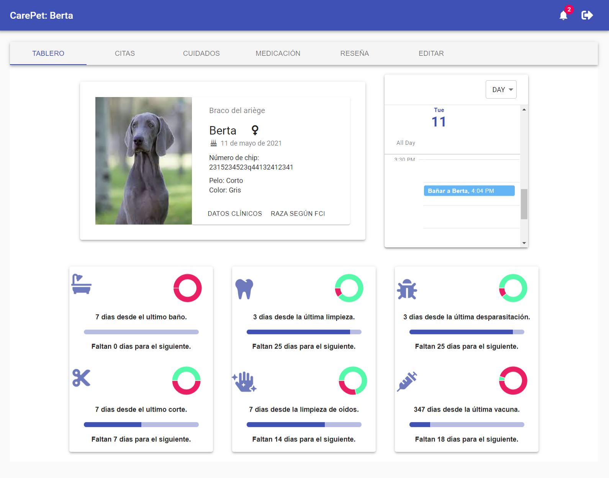
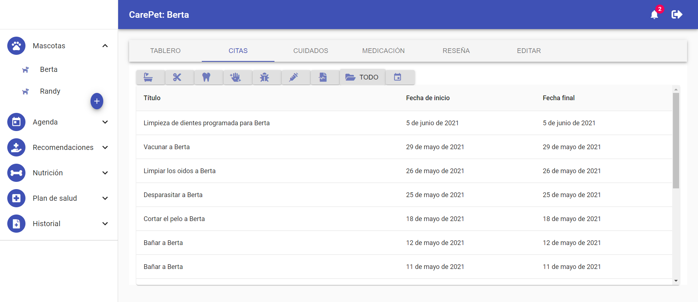
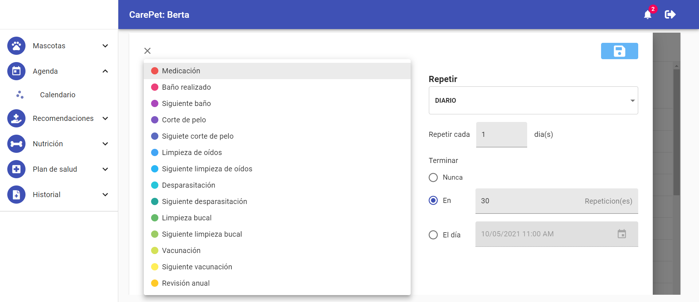

# CarePet - Api


<!-- PROJECT LOGO -->

<!-- <p align="center">
  <a href="https://infectme.herokuapp.com"> 
    
  </a>
  <br /> -->

  <!-- <h3 align="center">Infect Me</h3> -->

  <p align="center">
    Rest Api in charge of managing and storing the information of the <a href="https://github.com/joselrdg/CarePet-web">CarePet</a> website.
    <br />
    <a href="https://github.com/joselrdg/CarePet-api"><strong>Explore the docs »</strong></a>
    <br />
    <br />
    <a href="https://petvet-web.herokuapp.com/">View Demo</a>
    ·
    <a href="https://github.com/joselrdg/CarePet-api/issues">Report Bug</a>
    ·
    <a href="https://github.com/joselrdg/CarePet-api/issues">Request Feature</a>
  </p>
</p>


<!-- TABLE OF CONTENTS -->
<details open="open">
  <summary><h2 style="display: inline-block">Table of Contents 🚀</h2></summary>
  <ol>
    <li>
      <a href="#about-the-project">About The Project</a>
      <ul>
        <li><a href="#built-with">Built With</a></li>
      </ul>
    </li>
    <li>
      <a href="#getting-started">Getting Started</a>
      <ul>
        <li><a href="#prerequisites">Prerequisites</a></li>
        <li><a href="#installation">Installation</a></li>
      </ul>
    </li>
    <li><a href="#usage">Usage</a></li>
    <li><a href="#roadmap">Roadmap</a></li>
    <li><a href="#contributing">Contributing</a></li>
    <li><a href="#license">License</a></li>
    <li><a href="#contact">Contact</a></li>
    <!-- <li><a href="#acknowledgements">Acknowledgements</a></li> -->
  </ol>
    
</details>


<!-- ABOUT THE PROJECT -->
## About The Project
Rest Api in charge of managing and storing the information of the <a href="https://github.com/joselrdg/CarePet-web">CarePet website.</a>
To fill in the database, I program a script to scrape the website of the federation cynologique internationale, download all the pdfs present (so far 332 dog breeds divided into 10 groups) to the tmp folder, then another script is activated that processes all the pdfs, places all the characteristics of each race and extracts the images present in the pdfs. Then it stores the 332 breeds of dogs with all their characteristics in its database.
Then the api is in charge of managing the security of the requests, the information of the users, the care of their pets and of presenting the information of all the breeds of dogs accepted by the federation cynologique internationale.
### Dashboard:

### Simple graphics to see appointments quickly:

### Appointments:

### You can program your pet's drug guidelines:

### Calendar:




### Review and breeds of dogs:
Its own api provides you with a wealth of information on the 332 dog breeds approved by the Federation Cynologique Internationale.

### Recommendations:


<!-- Here's a blank template to get started:
**To avoid retyping too much info. Do a search and replace with your text editor for the following:**
`github_username`, `repo_name`, `twitter_handle`, `email`, `project_title`, `project_description` -->


### Built With 🛠️

* [NPM](https://www.npmjs.com/)
* [Express](http://expressjs.com/)
* [MongoDB](https://www.mongodb.com/)
* [Connect mongo](https://github.com/jdesboeufs/connect-mongo#readme)
* [Mongoose](https://mongoosejs.com/)
* [mongoose-paginate-v2](https://github.com/aravindnc/mongoose-paginate-v2)
* [Morgan](https://github.com/expressjs/morgan#readme)
* [Cors](https://www.npmjs.com/package/cors)
* [Axios](https://github.com/axios/axios)
* [Bcrypt](https://github.com/kelektiv/node.bcrypt.js#readme)
* [Cloudinary](https://cloudinary.com/)
* [Debug](https://github.com/visionmedia/debug#readme)
* [Dotenv](https://github.com/motdotla/dotenv#readme)
* [Faker](https://github.com/Marak/Faker.js)
* [Http-errors](https://github.com/jshttp/http-errors)
* [Jsonwebtoken](https://github.com/auth0/node-jsonwebtoken)
* [Multer](https://github.com/expressjs/multer)
* [Pdf-parse](https://gitlab.com/autokent/pdf-parse)
* [Png.js](https://github.com/foliojs/png.js)
* [Puppeteer](https://pptr.dev/)
<!-- * [Rimraf](https://github.com/isaacs/rimraf) -->


<!-- GETTING STARTED -->
## Getting Started

To get a local copy up and running follow these simple steps.

### Prerequisites

This is an example of how to list things you need to use the software and how to install them.
* npm
  ```sh
  npm install npm@latest -g
  ```

### Installation

1. Clone the repo
   ```sh
   git clone https://github.com/joselrdg/CarePet-web
   ```
2. Install NPM packages
   ```sh
   npm install
   ```
3. Create .ENV file with the following variables:
   ```sh
   REACT_APP_API_HOST=http://localhost:3001
   PORT=
   MONGODB_URI=
   JWT_SECRET= 
   CORS_ORIGIN=
   ```
4. Run the file to store some users and pets:
   ```sh
   npm run seeds
   ```
5. Run the file to scrape the Fci website, process the pdfs with the dog breeds and save the information in your database:
   ```sh
   npm run scraper
   ```
5. Run the application in development mode:
   ```sh
   npm run dev
   ```
5. Run the application:
   ```sh
   npm start
   ```


<!-- ROADMAP -->
## Roadmap

See the [open issues](https://github.com/joselrdg/CarePet-api/issues) for a list of proposed features (and known issues).


<!-- CONTRIBUTING -->
## Contributing ✒️

Contributions are what make the open source community such an amazing place to be learn, inspire, and create. Any contributions you make are **greatly appreciated**.

1. Fork the Project
2. Create your Feature Branch (`git checkout -b feature/AmazingFeature`)
3. Commit your Changes (`git commit -m 'Add some AmazingFeature'`)
4. Push to the Branch (`git push origin feature/AmazingFeature`)
5. Open a Pull Request


<!-- LICENSE -->
<!-- ## License 

Distributed under the MIT License. See `LICENSE` for more information. -->


<!-- CONTACT -->
## Contact

José Luis Rodríguez , [josesietepicos@gmail.com](mailto:josesietepicos@gmail.com)

LinkedIn , [https://www.linkedin.com/in/joseluis-rodriguez-gonzalez/](mailto:josesietepicos@gmail.com)

Project Link: [https://github.com/joselrdg/CarePet-api](https://github.com/joselrdg/CarePet-api)

Demo Link: [https://petvet-web.herokuapp.com/](https://infectme.herokuapp.com/)

<!-- ## Acknowledgements -->
